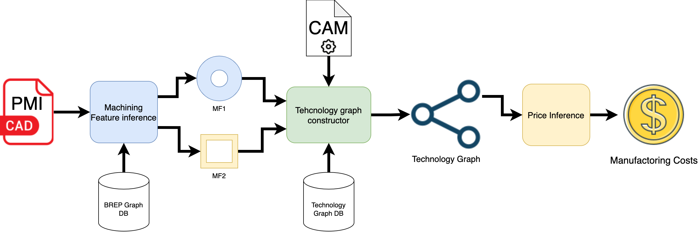

# CAD -> Technology Graph -> Price Framework
This framework is designed to address the following challenges:

- Inferring machining features from CAD models with PMI data
- Deriving [technology graphs](docs/Technology%20Graph.md) based on machining features and corresponding CAM operations
- Estimating manufacturing costs from the technological graph



A comprehensive description of the proposed solution can be found in the [Architecture section](docs/Architecture.md)

To set up python environment using conda or mamba run:
```shell
mamba env create -f environment.yml
```

To run machining feature model learning run:
```shell
python machining_features_inference/learn.py -i /path/to/inputs -o /path/to/outputs -n 25
```

To run inference pipeline:
```shell
python machining_features_inference/infer.py -i /path/to/inputs -o /path/to/outputs -m model_name
```


### Useful Datasets: 

 - **MFCAD++ dataset:** https://gitlab.com/qub_femg/machine-learning/mfcad2-dataset
 - MFCAD dataset: https://github.com/hducg/MFCAD\
 - Machining features dataset: https://github.com/madlabub/Machining-feature-dataset
 - ABC dataset https://deep-geometry.github.io/abc-dataset/ 
 - Fusion360Gallery dataset https://github.com/AutodeskAILab/Fusion360GalleryDataset 
 - FabWave dataset https://www.dimelab.org/fabwave-dataset-downloads 
 - Solid Letters dataset https://uv-net-data.s3.us-west-2.amazonaws.com/SolidLetters.zip 

### Useful Papers: 

 - **BrepNet** Jayaraman P. K. et al. Uv-net: Learning from boundary representations //Proceedings of the IEEE/CVF Conference on Computer Vision and Pattern Recognition. – 2021. – С. 11703-11712.
 - **UV-Net** Lambourne J. G. et al. Brepnet: A topological message passing system for solid models //Proceedings of the IEEE/CVF Conference on Computer Vision and Pattern Recognition. – 2021. – С. 12773-12782.
 - **MeshCNN** https://atomicsulfate.github.io/meshcnn-4-cadseg/#implementation 
 - **PointNet** https://github.com/pyg-team/pytorch_geometric/blob/master/examples/point_transformer_segmentation.py
 - **PointTransformer** https://github.com/pyg-team/pytorch_geometric/blob/master/examples/point_transformer_segmentation.py

### Models Source Code: 

 - https://gitlab.com/qub_femg/machine-learning/hierarchical-cadnet
 - https://github.com/AutodeskAILab/BRepNet
 - https://github.com/AutodeskAILab/UV-Net 

 