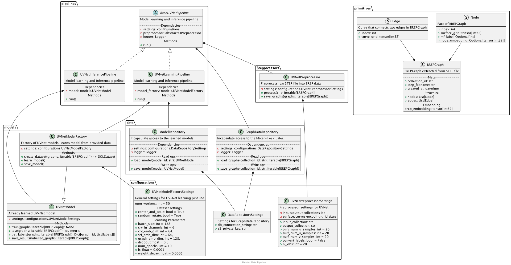

# CAD Price Architecture

## UV-Net pipeline
UV-Net is a neural network architecture
and representation designed to operate directly on Boundary
representation (B-rep) data from 3D CAD models. This pipeline describes a process of learning UV-Net neural network and inference process of unseen data.

The image below illustrates the data flow diagram for the UV-Net pipeline, which consists of three primary components:

 - Model flow (blue) - This encompasses the overall process of model creation, storage, and selection based on performance scores.
 - Learning data flow (yellow) - This data flow represents the various stages of training the UV-Net.
 - Inference data flow (red) - This data flow depicts the stages involved in processing raw data during inference.

Data flow architecture of UV-Net pipeline

### S3 buckets of CADs
In the present architecture, we regard the S3 bucket as a cloud-based directory that possesses a specific identifier
and can be perceived as a developed framework that functions as an independent source of CAD information. 
When referring to labeled CAD, we mean a CAD file that contains corresponding information about the machining features for each face it represents.

The main purpose of buckets is to separate different data for experiments to learn UV-Net model or to represent a results of inference of mechanical features for different stakeholders.

### BREP Graph storage
This component represents a Graph-based storage of BREP graphs.
As BREP Graph we consider a face-adjacency graph derived from
the B-rep, `G(V, E)`, to model the topology where the vertices
`V` represent the faces in the B-rep, while the edges `E` encode
the connectivity between the faces. Based on that representation, 
one can assign different features, such as labels or 2D representation to face or their connections,
such as curve 1D representation.

### BREP UV-Net preprocessor
This component is designed to preprocess 3D CAD files in STEP format for the purpose of training a neural network. The primary objective of this component is to extract BREP topology `G(V, E)` and assign features for the UV-Net:

For edges (`E`), the central concept is to represent the geometry of the curve (`C`) by discretizing its parameter domain into a regular 1D grid. This 1D UV-grid is then set as input edge features in `G`.

Each topological face (`V`) in a B-rep possesses an associated surface geometry (`S`) that could be a plane, sphere, cylinder, cone, or a freeform NURBS surface. Consequently, this surface is represented as a 2D grid and discretized according to the chosen grid size, and then attached to the face node as a feature attribute.

An example of this process is illustrated in the image below.

For the purpose of model training, this module also extracts face labels based on their corresponding mechanical feature labels.

The output of the preprocessor will be saved in the BREP Graph storage.

### UV-Net Factory
UN-Net factory is responsible for learning new models, based on the factory settings and provided data it tunes model to reach the best scores using [Optuna Framework](https://optuna.org/).
Best model could be saved with corresponding metrics into a model storage.

### Class diagram

## Technology graph inference pipeline

TBD... Need initial CAM data examples

## Manufacturing costs estimation pipeline

TBD... Need initial CAM data and price data