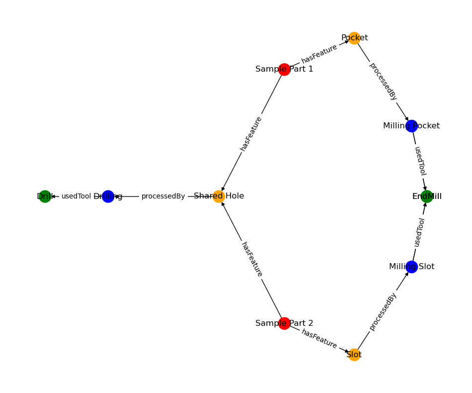

# Thechnology graph
A technology graph is a directed heterogeneous graph that represents the manufacturing 
process of a part. It captures the relationships between various machining 
features, tools, and Computer-Aided Manufacturing (CAM) operations. 
This graph can help optimize the manufacturing process, 
analyze alternative production methods, and minimize production time and cost.

Nodes:
 - Machining features with PMI (Product and Manufacturing Information) data
 - CAM operations (strategy)
 - Tools (tool specs, like diameter)

Edges:
- MF -> Operation (with processing time)
- Tool -> Operation

Let's consider a simple part with two machining features: a pocket and a hole. There are two ways to produce the part:

- Using a single tool for both operations: milling the pocket and drilling the hole.
- Using two different tools: an end mill for the pocket and a drill for the hole.

Here's an example of a technology graph in JSON format representing both ways of producing the part:
```json
    {
      "graph": {
        "nodes": [
          { "id": "part1", "type": "Part", "name": "Sample Part 1" },
          { "id": "part2", "type": "Part", "name": "Sample Part 2" },
          { "id": "shared_hole", "type": "Feature", "name": "Shared Hole", "diameter": 5, "depth": 10 },
          { "id": "pocket", "type": "Feature", "name": "Pocket", "width": 30, "length": 40, "depth": 5 },
          { "id": "slot", "type": "Feature", "name": "Slot", "width": 5, "length": 30, "depth": 5 },
          { "id": "drilling", "type": "CAMOperation", "name": "Drilling", "strategy": "PeckDrilling", "time": 2 },
          { "id": "milling_pocket", "type": "CAMOperation", "name": "Milling Pocket", "strategy": "AdaptiveClearing", "time": 5 },
          { "id": "milling_slot", "type": "CAMOperation", "name": "Milling Slot", "strategy": "Contour", "time": 3 },
          { "id": "tool1", "type": "Tool", "name": "Drill", "diameter": 5 },
          { "id": "tool2", "type": "Tool", "name": "EndMill", "diameter": 8 },
          { "id": "tool3", "type": "Tool", "name": "EndMill", "diameter": 10 }
        ],
        "edges": [
          { "source": "part1", "target": "shared_hole", "relation": "hasFeature" },
          { "source": "part1", "target": "pocket", "relation": "hasFeature" },
          { "source": "part2", "target": "shared_hole", "relation": "hasFeature" },
          { "source": "part2", "target": "slot", "relation": "hasFeature" },
          { "source": "shared_hole", "target": "drilling", "relation": "processedBy" },
          { "source": "pocket", "target": "milling_pocket", "relation": "processedBy" },
          { "source": "slot", "target": "milling_slot", "relation": "processedBy" },
          { "source": "drilling", "target": "tool1", "relation": "usedTool" },
          { "source": "milling_pocket", "target": "tool2", "relation": "usedTool", "alternative": 1 },
          { "source": "milling_pocket", "target": "tool3", "relation": "usedTool", "alternative": 2 },
          { "source": "milling_slot", "target": "tool2", "relation": "usedTool", "alternative": 1 },
          { "source": "milling_slot", "target": "tool3", "relation": "usedTool", "alternative": 2 }
        ]
      }
    }
```



This technology graph allows you to evaluate both ways of producing the part, considering the time required for each operation and the tools involved. By comparing these alternatives, you can choose the most efficient and cost-effective method for manufacturing the part.